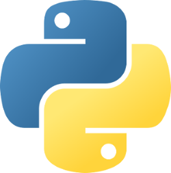

<!-- .element: style="margin-top: -5%;" -->
## Building OSS with Python

#### [Mario Garcia](http://mattdark.github.io) · [@mariogmd](https://twitter.com/mariogmd)

---

## Who am I?

***

- Self-taught person
- Free Software user<!-- .element: class="fragment" -->
- Speaker<!-- .element: class="fragment" -->
- Python developer<!-- .element: class="fragment" -->
- Programming teacher<!-- .element: class="fragment" -->

---

## Agenda

- What is OSS?
- Pre-checks<!-- .element: class="fragment" -->
- Project creation<!-- .element: class="fragment" -->
- README.md checklist<!-- .element: class="fragment" -->
- Coding Phase<!-- .element: class="fragment" -->
- Release Phase<!-- .element: class="fragment" -->
- Post-release<!-- .element: class="fragment" -->

---

## What is OSS?

***

#### Open Source Software is a computer software with its source code made available with a license in which the copyright holder provides the rights to study, change, and distribute the software to anyone and for any purpose. - Source: Wikipedia

---

## Pre-checks

***

- Able to explain your project in a tweet?
- Choose a name for the project<!-- .element: class="fragment" -->
- Check if domain name / App name is available?<!-- .element: class="fragment" -->
- List and learn tools required for the project<!-- .element: class="fragment" -->
- Prepare mock-up and one page design document<!-- .element: class="fragment" -->
- List previous / similar implementations<!-- .element: class="fragment" -->
- Start a blog post to document the journey<!-- .element: class="fragment" -->
- Ask if project could be solved in a modular way<!-- .element: class="fragment" -->

---

## Project Creation

***

- Create a repository in any of the SCM sites
- Create a README.md<!-- .element: class="fragment" -->
- Create a LICENSE file<!-- .element: class="fragment" -->
- Create a CODE_OF_CONDUCT.md<!-- .element: class="fragment" -->
- Create a CONTRIBUTING.md<!-- .element: class="fragment" -->

---

## README.md Checklist

***

- Title
- Logo<!-- .element: class="fragment" -->
- Description<!-- .element: class="fragment" -->
- Prerequisite for using software (if any)<!-- .element: class="fragment" -->
- Install<!-- .element: class="fragment" -->
- Example usage<!-- .element: class="fragment" -->
- Screenshots and GIFs<!-- .element: class="fragment" -->
- Benchmarks<!-- .element: class="fragment" -->
- Contributors<!-- .element: class="fragment" -->
- Backers and sponsors<!-- .element: class="fragment" -->
- Atributions<!-- .element: class="fragment" -->

---

## Coding Phase

***

- Install required developer tools
- Write tests<!-- .element: class="fragment" -->
- Host the documentation of the code<!-- .element: class="fragment" -->
- Encourage OSS culture<!-- .element: class="fragment" -->
- Contribute to other OSS projects<!-- .element: class="fragment" -->

---

## Release Phase

***

- Package software
- Publish the software<!-- .element: class="fragment" -->
- Create the release page<!-- .element: class="fragment" -->

---

## Post-release

***

- Publish a blog post
- Tweet<!-- .element: class="fragment" -->
- Reddit<!-- .element: class="fragment" -->
- LinkedIn<!-- .element: class="fragment" -->
- Mailing lists<!-- .element: class="fragment" -->
- Prepare slides and give talks<!-- .element: class="fragment" -->

---

## Python

---

## Learn More

_[python.org](https//python.org)_

___

[@mariogmd](https://twitter.com/mariogmd)
[iscmariog](https://facebook.com/iscmariog)

mattdark@mozilla-mexico.org
